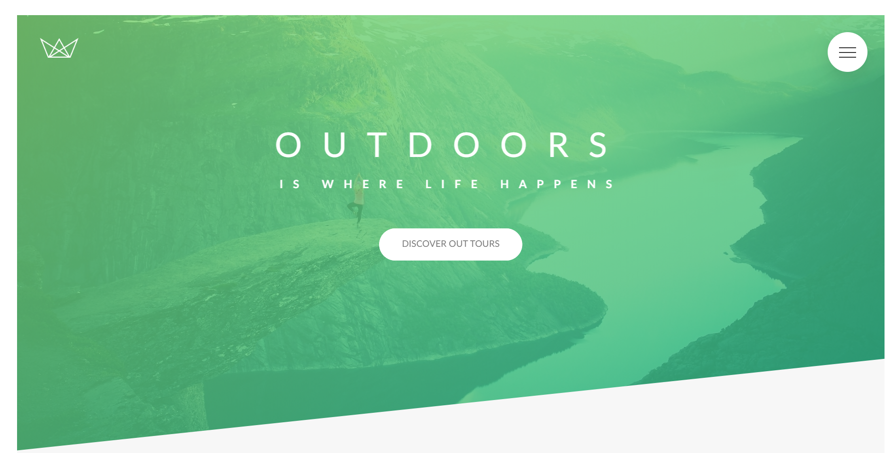
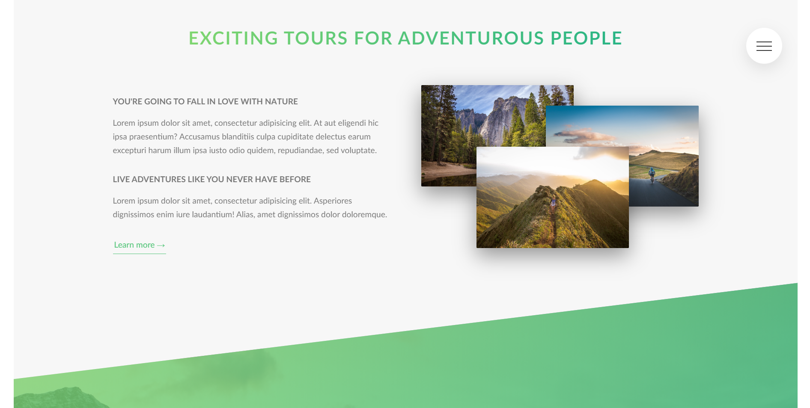
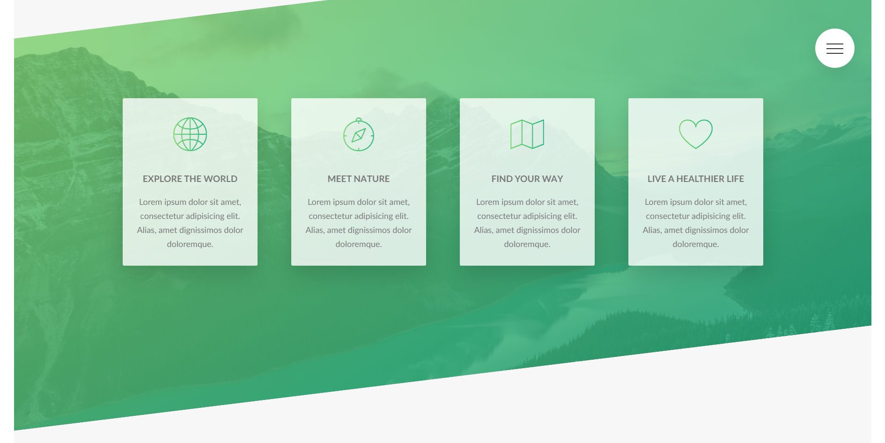
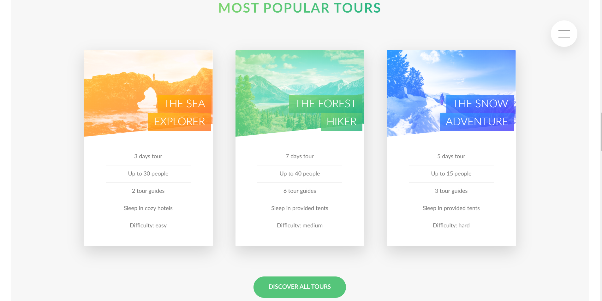
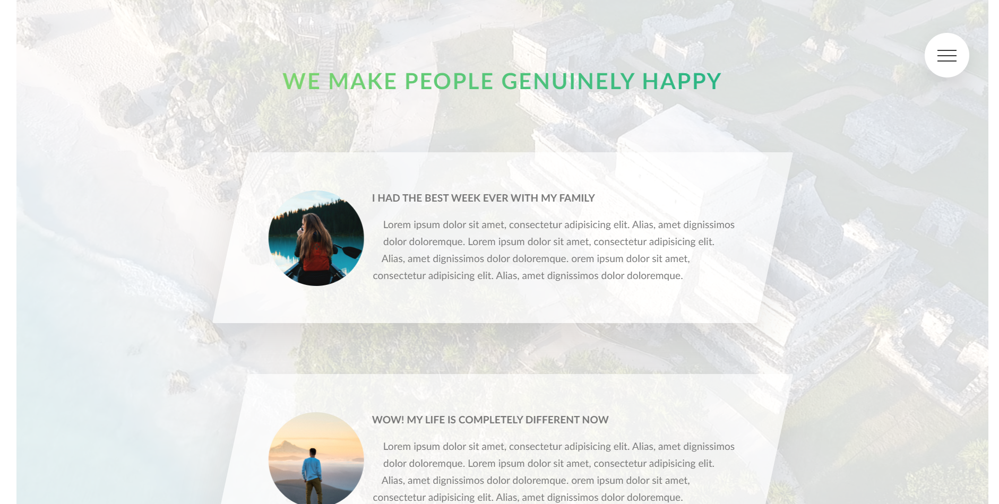
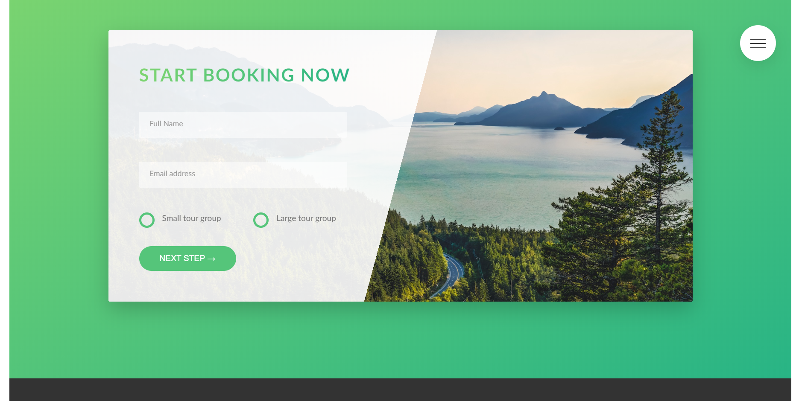
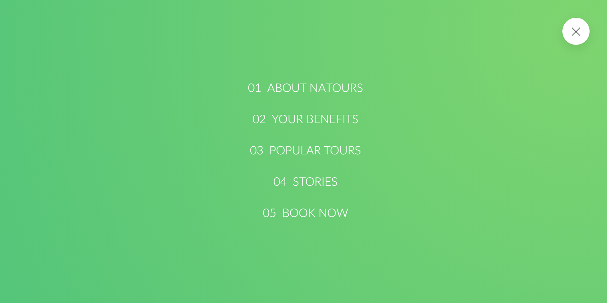

<!-- AUTO-GENERATED-CONTENT:START (STARTER) -->

 

<h1 align="center">
  Natours
</h1>

***"Natours"*** is a responsive website.

This app was created during online course  [uedmy.com](https://www.udemy.com/course/advanced-css-and-sass/)

***
###Demo screenshots

***
###Technologies
1. Html
1. Scss

***

###Project structure

A quick look at the top-level files and directories you'll see in a Gatsby project.

    .
    ├── css
    ├── img
    ├── sass
        ├── abstracts
        ├── base
        ├── components
        ├── layout
        ├── pages
        ├── main.scss
    ├── .gitignore
    ├── index.html
    ├── gatsby-browser.js
    ├── package-lock.json
    ├── package.json
    └── README.md

  **`/css`**: This directory contains css code created from .scss files with scss compiler

  **`/img`**: This directory contains images
    
   **`/sass`**: This directory contain .scss files
    
   **`/abstracts`**: This directory contain variables, mixins and functions
    
   **`/base`**: This directory contains base .scss files related to media queries, animations and utility files
    

  **`/components`**: This directory contains .scss components
  
  **`/layout`**: This component contains layout files for example  header, footer etc.

 
<!-- AUTO-GENERATED-CONTENT:END -->
